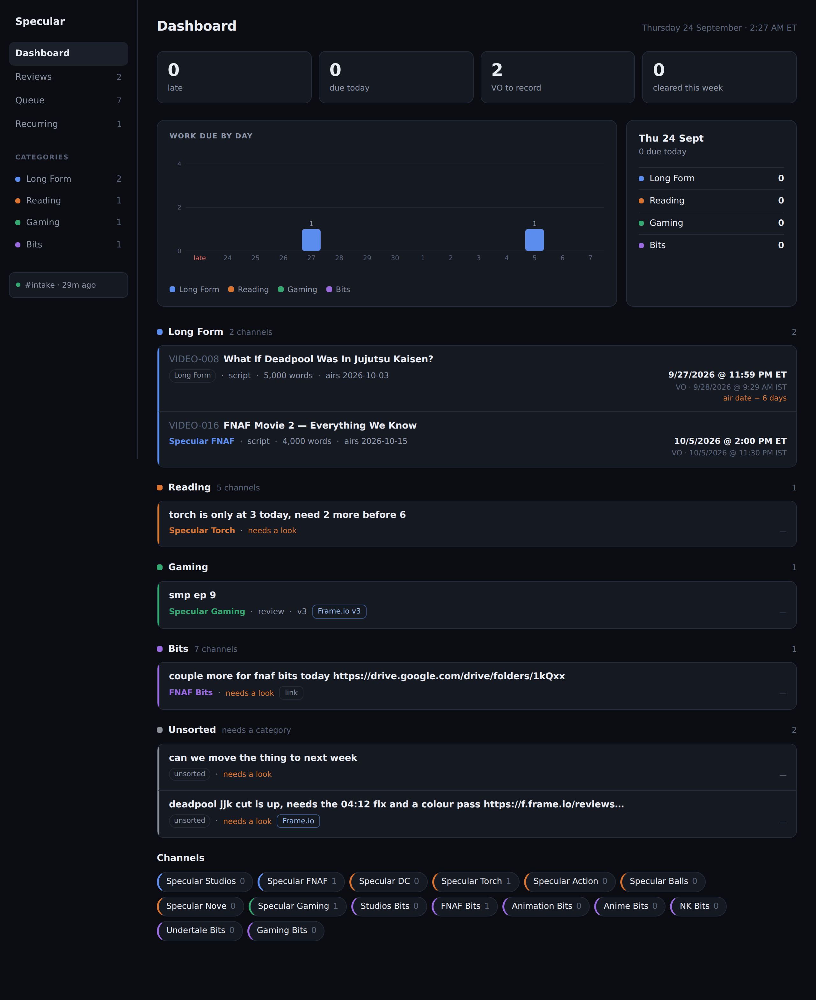
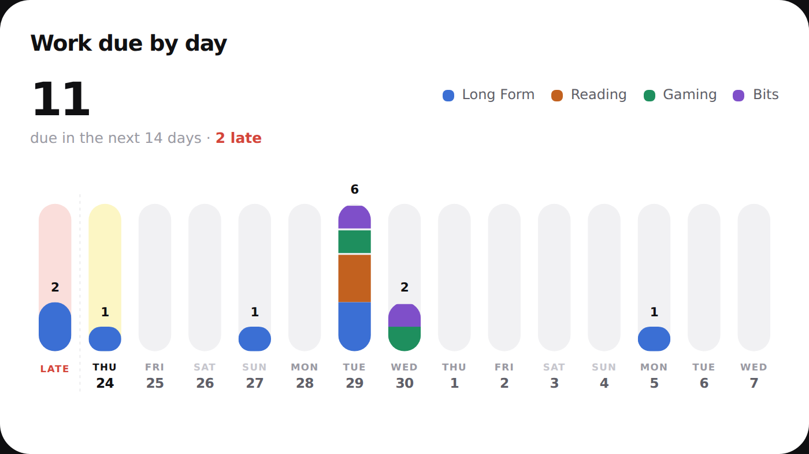
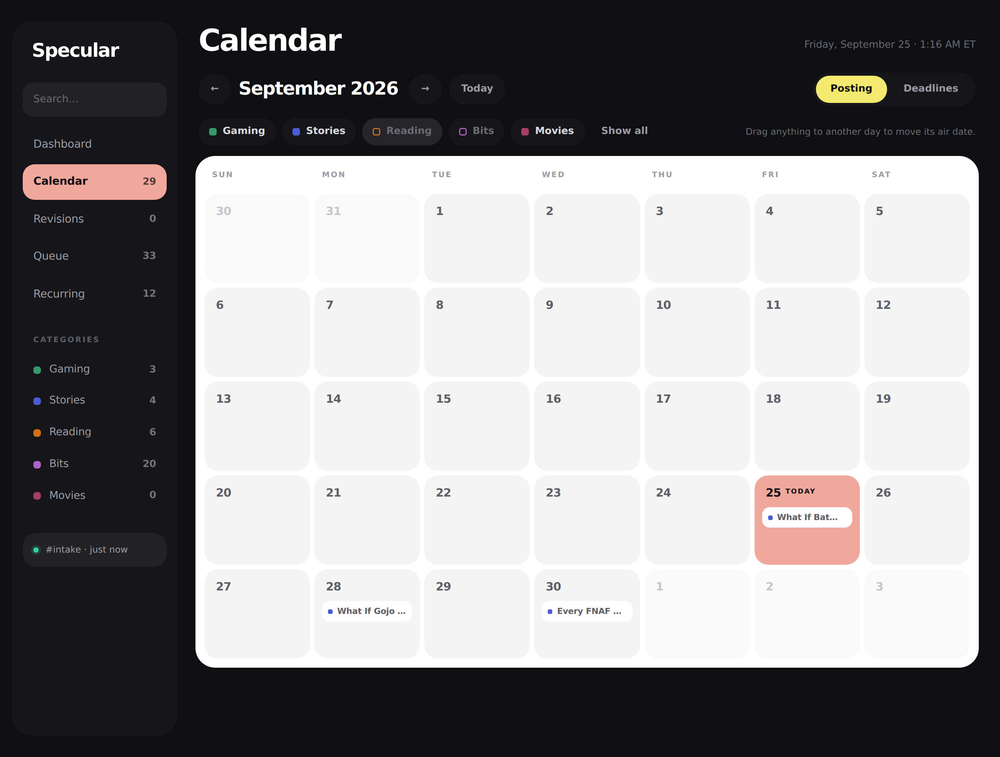
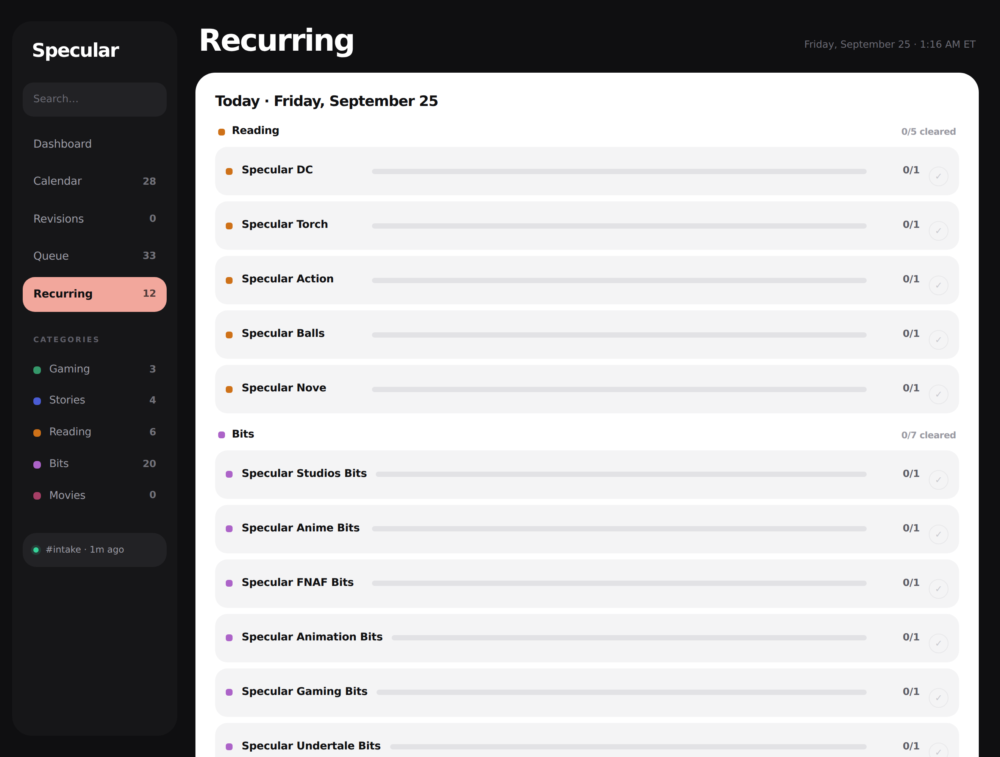
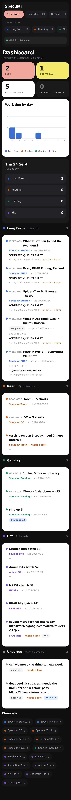
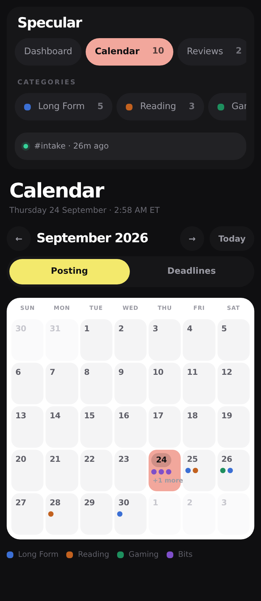

# The board

One page showing everything the bot has filed. Server-rendered HTML, no build
step and no client framework — it is a list of short records, and a list of
short records does not need a bundler.



## What's on it

**Work due by day** — a headline count, then a column per day.



Every day keeps its slot whether or not anything is due, so an empty week reads
as empty rather than as missing. Overdue work collects in its own pink column
at the left, behind a dashed rule; today's column is yellow, matching the tile
above it. Each bar carries its own count, so there is no y-axis to read a
number off. Where a day holds more than one category the bar is one pill with
2px gaps between them.

**VO to record**, soonest first — the spine of the day. A deadline the parser
worked out rather than read is marked *air date − 6 days* in orange, so a
derived time never reads as a stated one.

**Revisions** — everything carrying a Frame.io link, including f.io short
links. This is the thing that used
to mean scrolling back through DMs.

**Everything else** — open records that aren't in either list above.

**Calendar** — a month of everything, on the day it goes out.



Two modes, switched top right: **Posting** plots the air date, **Deadlines**
plots the day the work is due.

- **Drag** anything to another day to move it. In Posting that moves the air
  date; in Deadlines it moves the deadline and keeps its time of day. A VO
  deadline that was worked out from the air date follows it; one someone
  stated stays put.
- **Category toggles** above the grid hide or show a category. They double as
  the legend, and the calendar remembers how you left them.
- Click a chip for that record, a date for that whole day.

Every record's page also has an **air date box** — for a phone, where dragging
is awkward, or for a date weeks out.

Dates read M/D/YYYY everywhere, and every air date carries a live countdown:
"airs 9/28/2026 · in 3 days", turning amber inside three days.

**Channels** — every channel with its open count. Click one and you get
everything filed under it, cleared items included.

Each row is `Title · Channel · Needs VO · Deadline`, colour-coded by category
down the left edge. Click a row for the full record: every field, the story
brief, the links, a **Clear this** button, and a link back to the original
Discord message.

A row the parser wasn't sure about is flagged **needs a look**.

## Recurring — the daily batches



Every bits channel and every reading channel opens its batch by itself each
morning at 06:00 ET — twelve a day, shown as two groups. You send nothing. Numbers run continuously per channel, so "FNAF Bits batch 141" is
that channel's 141st batch ever, not its 141st this month.

One batch per channel, twelve a day. To change that, edit `perDay` on the
channel in [`src/catalog.ts`](src/catalog.ts) — one number, and the next
morning follows it. Removing a channel's `recurring` block stops it opening at
all.

The tick beside a channel clears its whole day in one press.

**Working ahead** is the button on that page. It opens tomorrow's batches now,
so you can clear them today. Tomorrow morning's run finds them already there
and leaves them exactly as you left them, cleared ones included — the opener
keys every batch by channel, date and index, so it can never double-open.

Run it by hand any time:

```bash
npm run batches              # today
npm run batches -- tomorrow
npm run batches -- 2026-10-01
```

## On a phone

Not a shrunken desktop. The rail becomes a scrolling strip of pills across the
top, every row drops to one column so a title gets the full width instead of
wrapping four words deep beside its deadline, and a calendar cell shows its
work as coloured dots — at 390px a two-word truncation says less than a colour
does. The chart keeps its size and scrolls sideways rather than shrinking into
a smear.

 

## The morning digest

At 08:00 ET the bot posts one message: the four long-form videos whose
voiceover is closest, anything late, anything due today, and how the bits
stand. It picks by voiceover deadline, because that is what the day is built
around. Bits get one summary line rather than seven rows.

```
DIGEST_CHANNEL_ID=…     # the channel to post into. Empty = no digest
DIGEST_CRON=0 8 * * *   # when, in ORG_TZ
DIGEST_COUNT=4          # how many priorities it names
```

Posting is recorded per day, so a restart can't send it twice. Preview it
without sending:

```bash
npm run digest
```

## The overdue nudge

Once something passes its deadline the bot says so in the same channel — once
per item, never again. Hourly by default (`NUDGE_CRON`), and bits are left out
because their batches run past 6pm most days by design.

## Running it locally

You need Postgres. The quickest way on a Mac:

```bash
brew install postgresql@16
brew services start postgresql@16
createdb specular
```

Then in `.env`:

```
DATABASE_URL=postgres://localhost:5432/specular
DASHBOARD_PASSWORD=pick-something
```

```bash
npm run web
```

Open <http://localhost:8080>. The schema is created on first start — there is
no separate migrate step.

The bot and the board are two processes. Run both:

```bash
npm run bot     # one terminal tab
npm run web     # another
```

Without `DATABASE_URL` the bot still parses and replies, it just stores
nothing, and the board says so rather than showing an empty page.

## Running it on Railway

One service runs both halves. `npm start` boots the bot, then the board, in
the same process — so there is one deploy, one set of variables, and no way
for the two to drift apart.

In the service you already have:

1. **+ New → Database → Add PostgreSQL.** Railway creates `DATABASE_URL`.
2. **Variables → New Variable → Add Reference →** `DATABASE_URL`.
3. **Variables → New Variable →** `DASHBOARD_PASSWORD`, anything you'll
   remember.
4. **Settings → Networking → Generate Domain.** Port `8080`.
5. **Variables → New Variable →** `PUBLIC_URL`, the domain from step 4 with
   `https://` in front. This is what makes each Discord reply link straight to
   its record.

Redeploy. The log should say:

```
[bot] logged in as ashtracker#1234
[web] listening on :8080
[web] storage: connected
```

Open the domain, enter the password, and the board is there.

To split them later — a worker for the bot, a web service for the board —
set `SERVICE=bot` on one and `SERVICE=web` on the other. Nothing else
changes.

## The password

`DASHBOARD_PASSWORD` is required and the board refuses to start without one.
It shows the whole studio's work — deadlines, briefs, every Frame.io link —
on a public URL, so an open one is a link away from anybody.

It is a single shared password, not accounts. That is the right size for now;
say the word when other people need their own logins.
